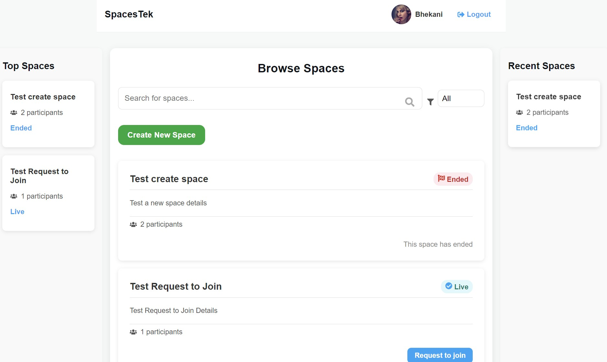

<p align="center">
  
</p>

<p align="center">
  <a href="https://twitter.com/media_sfu">
    
  </a>
  <a href="https://www.mediasfu.com/forums">
    
  </a>
  <a href="https://github.com/MediaSFU">
    
  </a>
  <a href="https://www.mediasfu.com/">
    
  </a>
  <a href="https://www.youtube.com/channel/UCELghZRPKMgjih5qrmXLtqw">
    
  </a>
</p>

MediaSFU provides next-level media streaming capabilities with advanced features for dynamic video grids, participant management, and custom media rendering. With the **SpacesTek Advanced** application, users can fully harness the power of MediaSFU for immersive media experiences.

---

# SpacesTek Advanced

Welcome to the **SpacesTek Advanced** repository! This monorepo extends the foundational SpacesTek setup, showcasing advanced MediaSFU features like custom video grids, real-time media controls, and participant management. Whether you're hosting a seminar, facilitating collaboration, or creating immersive video experiences, this application demonstrates how to achieve the next level of media integration.

---

## Table of Contents

1. [Overview](#overview)
2. [Key Features](#key-features)
3. [Integration Steps](#integration-steps)
    - [Advanced Media Services](#advanced-media-services)
    - [Dynamic Video Grids](#dynamic-video-grids)
    - [Custom Media Components](#custom-media-components)
4. [Key Components](#key-components)
5. [SpacesTek Visual Showcase](#spacestek-visual-showcase)
6. [Getting Started](#getting-started)
7. [Contributing](#contributing)
8. [License](#license)

---

## Overview

The **SpacesTek Advanced** application is the ultimate demonstration of MediaSFU's capabilities, providing robust tools for managing participants, rendering media, and creating dynamic spaces. By leveraging advanced components and customizations, this application is ideal for scalable and interactive video-based solutions.

---

## Key Features

### 1. Dynamic Video Grids
- **Flexible Layouts**: Automatically adjusts based on the number of participants.
- **Custom Components**: Supports dynamic rendering using `FlexibleGrid` and `VideoCardTransformer`.

### 2. Real-Time Media Controls
- **Participant Management**: Mute/unmute, remove participants, and assign roles dynamically.
- **Advanced Video Handling**: Toggle video streams, switch cameras, and select devices.

### 3. Backend Synchronization
- **API Integration**: Syncs frontend actions with backend state for consistent media control.
- **Modular Backend**: Extensible API endpoints for production-level environments.

### 4. Custom Media Rendering
- **Custom Video Cards**: Personalize video streams with overlays, controls, and styling.
- **Tailored Grids**: Implement application-specific layouts for media rendering.

---

## Integration Steps

### Advanced Media Services

Enhance the core `UseMediasfuSdkService` service to include advanced video controls:

1. **Video Toggling**: Turn video streams on/off for individual participants.
2. **Camera Switching**: Allow users to switch between front and rear cameras.
3. **Device Selection**: Dynamically select and render video streams from specific devices.

### Dynamic Video Grids

Leverage `FlexibleGrid` and `VideoCardTransformer` for creating dynamic, responsive video grids:
- **Responsive Layouts**: Grids that adapt to the number of active video streams.
- **Custom Styling**: Use `VideoCard` components to apply branding and personalization.

### Custom Media Components

Build tailored components like:
- **`MediasfuGenericAlt`**: A custom version of the default MediaSFU handler, with enhanced flexibility.
- **`VideoCardTransformer`**: Apply custom transformations, such as overlays, to video components.

---

## Key Components

### 1. MediasfuGenericAlt
A customized version of `MediasfuGeneric` with support for:
- **Custom Grids**: Replace default layouts with tailored media rendering.
- **Enhanced Controls**: Integrate advanced media controls seamlessly.

### 2. VideoCardTransformer
Transforms video components by:
- Adding participant overlays (e.g., names, status icons).
- Applying dynamic styles to video streams.

### 3. ParticipantCard
Displays participant-specific data, such as:
- **Video Stream**: Render video streams dynamically.
- **Audio Status**: Show mute/unmute status.
- **Custom Actions**: Add buttons for managing participants.

---

## SpacesTek Visual Showcase


Here’s a visual walkthrough of SpacesTek. These images represent various features and user interfaces of the platform:

<div style="display: grid; grid-template-columns: 1fr 1fr; gap: 16px; margin: 20px 0;">
  <div>
    
    <p style="text-align: center;">Create Space</p>
  </div>
  <div>
    
    <p style="text-align: center;">User Login</p>
  </div>
  <div>
    
    <p style="text-align: center;">Space Details</p>
  </div>
  <div>
    
    <p style="text-align: center;">Browse Spaces</p>
  </div>
</div>

---

## Getting Started

### Clone the Repository
```bash
git clone https://github.com/MediaSFU/SpacesTekAdvanced.git
cd SpacesTekAdvanced
```

### Set Up Your Framework
Navigate to your desired framework directory (e.g., `mediasfu_angular`, `mediasfu_reactjs`) and follow the README for specific setup instructions.

---

## Contributing

We welcome contributions to enhance SpacesTek Advanced. Read our [Contribution Guidelines](CONTRIBUTING.md) for details on how to contribute.

---

## License

This project is licensed under the [MIT License](LICENSE).
